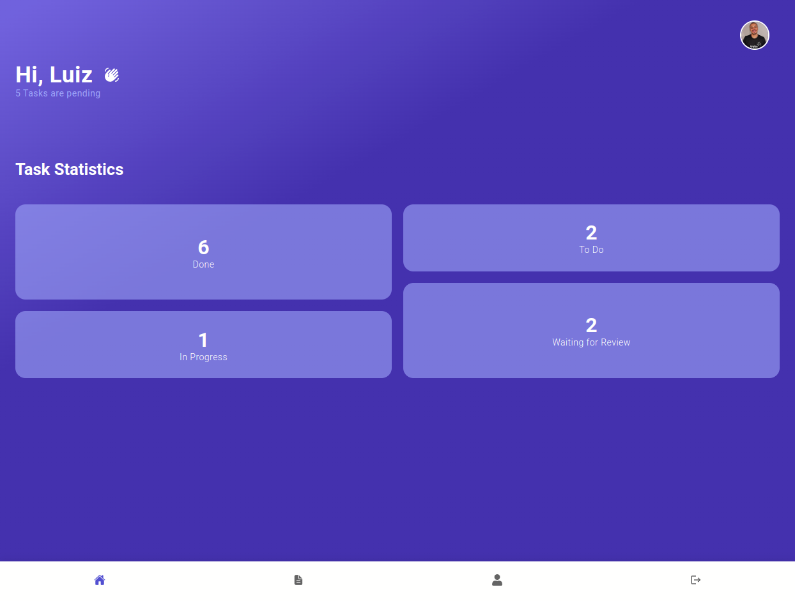
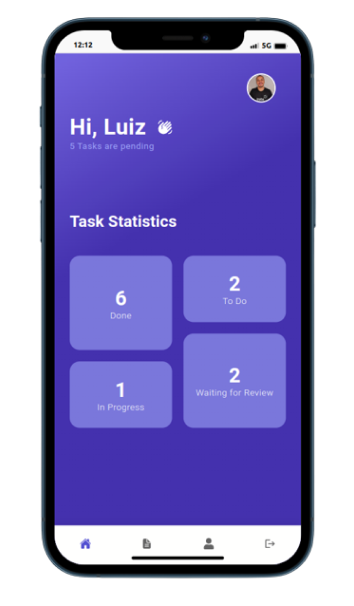
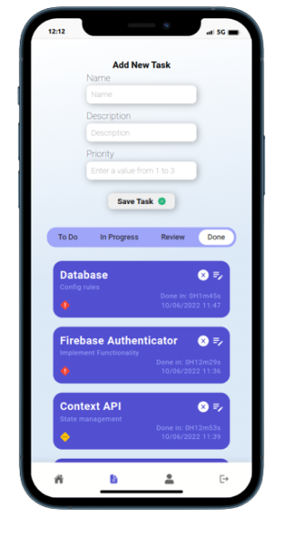

<h1 align="center">
  Daily Tasks
  
Aplicativo simples e intuitivo para gerenciar suas tarefas de forma rápida e fácil

</h1>

<h1 align="center">
  

    
  

  

    
    
  

</h1>

### 📜 Sobre
Este é um projeto para gerenciar tarefas diárias de maneira rápida e fácil proporcionando uma melhor gestão do tempo a pessoa usuária. Construído com as tecnologias mais populares, este repositório contem uma aplicação FrontEnd em ReactJS.

### 🔽 Requisitos
1. Ser possivel fazer login no app através do **Firebase Authentication**.
2. Salvar as tarefas do usuário em um banco de dados utilizando o  **Cloud Firestore**.
3. Realizar operações de **CRUD** (Create, Read, Update, Delete).

### :rocket: Começando
1. ``git@github.com:GuilhermeRX/Daily-Tasks-Firebase.git``
2. ``cd Daily-Tasks-Firebase``

### 💻 Iniciando com o Front-end 
1. ``npm i``
2. ``npm start``

### 🧰  Ferramentas utilizadas
- ⚛️ **ReactJs** - Biblioteca Javascript para criar interfaces de usuário.
- 💅 **Styled Components** - Biblioteca Javascript pra estilizar componentes.
- 🔒 **Firebase Authenticator** - Fornece serviços para autenticar usuários no seu aplicativo.
- 🎲 **Cloud Firestore** - Banco de dados NoSQL flexível e escalonável.

 com 💜 Luiz Guilherme 

